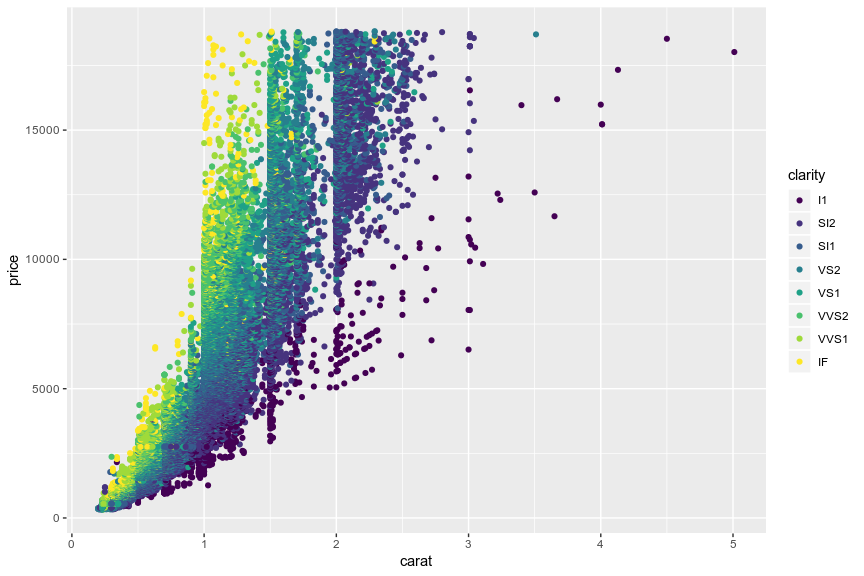

Pendahuluan
================
Muhammad Aswan Syahputra
4/24/2019

## R Markdown

Ini merupakan dokumen R Markdown yang dapat digunakan untuk membuat
dokumen HTML, PDF, dan bahkan dokumen berekstensi .doc, .docx atau .odt.
Anda dapat membuat dokumen tulisan, salindia presentasi, dan laman web
statis maupun interaktif dengan melalui R Markdown. Penggunaan R
Markdown dalam proyek analisis data akan membuat alur kerja menjadi
lebih mudah dan *reproducible*. Informasi lebih lanjut mengenai R
Markdown dapat dilihat pada pranala [ini](http://rmarkdown.rstudio.com).

Dokumen R Markdown umumnya terdiri atas dua komponen, yaitu teks dan
kode R. Teks dapat dituliskan seperti biasa dengan menggunakan kaidah
*formatting* dokumen markdown. Silakan klik *menu* **Help – Markdown
Quick Reference** untuk mempelajari cara *formatting* dokumen markdown.
Sedangkan kode R harus dituliskan ke dalam bagian yang disebut dengan
*chunk*. Berikut merupakan contoh *chunk* yang berisi kode R untuk
melihat isi 6 baris pertama dataset mtcars (mtcars adalah data bawaan
yang tersedia di
    R):

``` r
head(mtcars) 
```

    ##                    mpg cyl disp  hp drat    wt  qsec vs am gear carb
    ## Mazda RX4         21.0   6  160 110 3.90 2.620 16.46  0  1    4    4
    ## Mazda RX4 Wag     21.0   6  160 110 3.90 2.875 17.02  0  1    4    4
    ## Datsun 710        22.8   4  108  93 3.85 2.320 18.61  1  1    4    1
    ## Hornet 4 Drive    21.4   6  258 110 3.08 3.215 19.44  1  0    3    1
    ## Hornet Sportabout 18.7   8  360 175 3.15 3.440 17.02  0  0    3    2
    ## Valiant           18.1   6  225 105 2.76 3.460 20.22  1  0    3    1

Anda dapat membuat *chunk* kode R dengan cara klik tombol **Insert – R**
atau melalui pemintas **Ctrl + Alt + I**. Jika ingin menjalankan kode R
dalam *chunck* tersebut, Anda dapat menggunakan pemintas **Ctrl +
Enter** (menjalankan satu baris kode) atau **Ctrl + Shift + Enter**
(menjalankan semua kode dalam *chunk*). Sekarang buat dan jalankanlah
*chunk* baru yang isinya adalah baris kode R berikut:

``` r
filled.contour(volcano,
               color.palette = terrain.colors, 
               plot.title = title("Topografi Gunung Maunga Whau"), 
               key.title = title("Tinggi\n(meter)"))
```

<!-- -->

Setelah selesai membuat dokumen R Markdown yang berisikan teks beserta
kode R, Anda dapat klik tombol **Knit** atau pemintas **Ctrl + Shift +
K** untuk menghasilkan dokumen final sesuai dengan format dokumen yang
diinginkan. Dokumen final yang dihasilkan akan berisi teks, kode R,
serta *output* dari kode R yang dituliskan. Dalam contoh ini format
dokumen final keluaran R Markdown setelah menjalankan **Knit** adalah
dokumen markdown yang akan diolah oleh GitHub menjadi laman web HTML.
Anda dapat mengatur format dokumen keluaran dengan cara mengubah baris
*output* pada YAML metadata (lihat baris paling atas dokumen ini)
seperti contoh berikut:

    ---
    title: "Pendahuluan"
    author: "Muhammad Aswan Syahputra"
    date: "4/24/2019"
    output: word_document
    editor_options: 
      chunk_output_type: console
    ---

## ggplot2

Bahasa R memiliki berbagai sistem untuk membuat grafik, contohnya base,
lattice, ggplot, dan lain-lain. Namun dalam lokakarya ini Anda akan
berfokus pada sistem ggplot saja. Sistem pembuatan grafik dengan ggplot
dapat dilakukan dengan menggunakan paket ggplot2. Anda dapat memasangnya
dengan cara menjalankan `install.packages("ggplot2")` atau melalui
`install.packages("tidyverse)"` (ggplot2 merupakan bagian dari
Tidyverse). Anda juga dapat memasang paket melalui menu **Tools –
Install Packages…** pada RStudio. Silakan pasang paket ggplot2 terlebih
dahulu jika Anda belum memasangnya.

Anda harus mengaktifkan paket terlebih dahulu untuk dapat menggunakan
fungsi-fungsi yang terdapat dalam paket tersebut. Cara mengaktifkan
paket adalah dengan cara menjalankan `library(nama_paket)` atau
`library("nama_paket")` pada *chunk* R Markdown, R Script, atau konsol
RStudio jika Anda bekerja di sesi interaktif. Ingat bahwa paket harus
selalu diaktifkan sebelum memulai sesi analisis\! Sekarang aktifkanlah
paket ggplot2 dengan cara mengganti bagian \_\_\_ dengan jawaban yang
tepat\!

``` r
library(ggplot2)
```

Anda dapat menggunakan fungsi `qplot()` untuk membuat grafik menggunakan
ggplot2. Silakan jalankan `help(qplot)` atau `?qplot` pada konsol
RStudio untuk membuka laman dokumentasi fungsi `qplot()`. Setelah Anda
membaca dokumentasi tersebut, isilah bagian \_\_\_ pada *chunk* berikut
untuk membuat grafik hubungan antara carat (sumbu x), price (sumbu y)
dan clarity dari dataset diamonds (dataset diamonds terdapat dalam paket
ggplot2)\!

``` r
qplot(x = carat, y = price, colour = clarity, data = diamonds)
```

<!-- -->

Selamat Anda telah berhasil membuat grafik pertama menggunakan ggplot2\!
Selain meggunakan fungsi `qplot()` Anda juga dapat menggunakan fungsi
`ggplot()` untuk membuat grafik. Berikut merupakan kode R untuk membuat
grafik dari dataset diamonds yang persis sama dengan grafik pada *chunk*
sebelumnya:

``` r
ggplot(data = diamonds, mapping = aes(x = carat, y = price, colour = clarity)) +
  geom_point()
```

<!-- -->

Anda juga dapat menuliskan kode R di atas dalam bentuk seperti ini:

``` r
ggplot(data = diamonds) +
  geom_point(mapping = aes(x = carat, y = price, colour = clarity))
```

<!-- -->

Meskipun penulisan kode R untuk membuat grafik menggunakan fungsi
`ggplot()` relatif lebih panjang, lebih banyak kostumisasi dan
pengaturan grafik yang dapat dilakukan dengan menggunakan fungsi
`ggplot()` dibandingkan fungsi `qplot()`. Dalam lokakarya ini Anda akan
diminta untuk membuat banyak grafik dengan menggunakan struktur
penulisan kode R sebagai berikut:

``` 
ggplot(data = <DATA>) +
  <GEOM_FUNCTION>(mapping = aes(<MAPPINGS>))  
```

Sekarang Anda dipersilahkan klik tombol **Knit** atau menjalankan
pemintas **Ctrl + Shift + K** untuk mengkonversi dokumen R Markdown ini
menjadi dokumen final (dokumen berekstensi .md). Kemudian silakan unggah
hasil kerja Anda ke repositori GitHub dengan cara yang akan ditunjukan
oleh instruktur. Setelah berhasil, silakan akses berkas
001\_pendahuluan.md dalam direktori vignettes di repositori GitHub milik
Anda tersebut.
